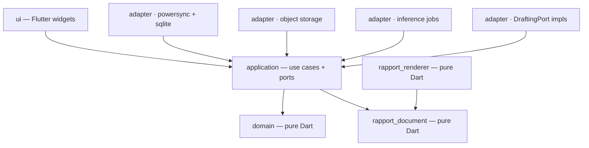
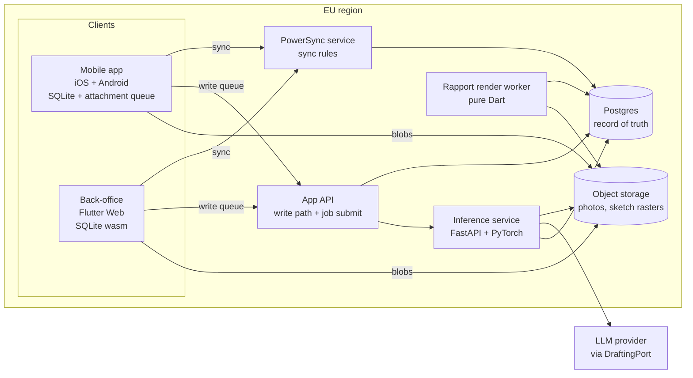
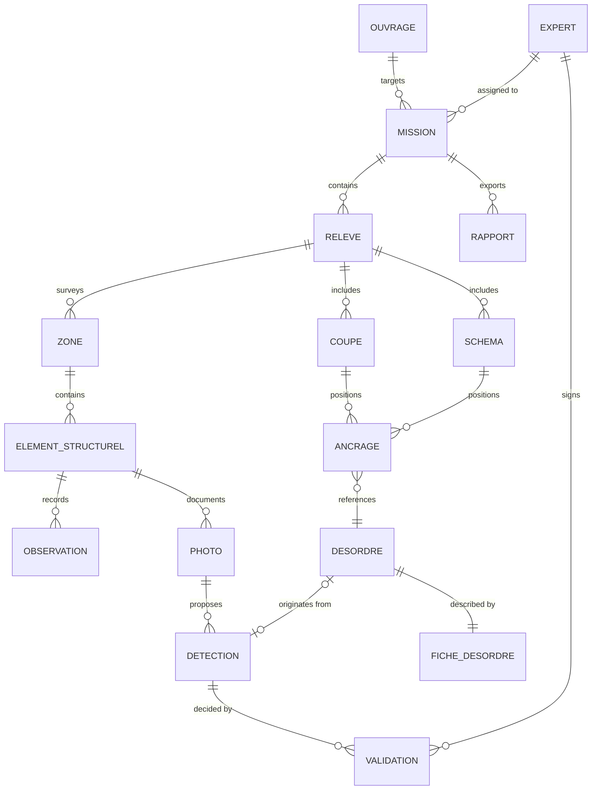

# Architecture Spine — Diagnostic Structurel IA

## Design Paradigm

**Local-first with server-authoritative reconciliation**, ports-and-adapters inside each unit.

The device's SQLite database is the only surface the UI reads from or writes to. Postgres is the record of truth. Divergence is reconciled by the sync engine, never by UI code. Within each unit, the domain sits at the centre and every framework — Flutter, PowerSync, Supabase, the model providers — is an adapter at the edge.



Dependencies point inward only. `domain`, `rapport_document`, and `rapport_renderer` import no framework — that is what makes the sync engine, the storage backend, and the model providers replaceable.

## Invariants & Rules

### AD-1 — Local-first, server-authoritative
- **Binds:** all
- **Prevents:** units treating the server as the live read path and blocking the UI on the network.
- **Rule:** the UI reads and writes only on-device SQLite. No UI code path awaits a network call. Postgres is the record of truth; reconciliation is the sync engine's job. The on-device database is encrypted at rest — a phone carries a complete building diagnostic for as long as it stays offline.

### AD-2 — Single-writer ownership of a Relevé
- **Binds:** CAP-1, CAP-2, CAP-4
- **Prevents:** two devices editing one Relevé, forcing merge or CRDT semantics that no requirement specifies.
- **Rule:** a Relevé has exactly one owning device-assignment at a time. A second Expert must take ownership before writing. Concurrent writes to one Relevé are a bug, not a case to merge.

### AD-3 — Binaries never travel in the sync stream
- **Binds:** CAP-3, CAP-4, CAP-5, CAP-11
- **Prevents:** photo bytes bloating the sync stream, and a row being unusable until its blob lands.
- **Rule:** photos and sketch rasters live in object storage, uploaded through the attachment queue and addressed by content hash. The hash is taken over the bytes exactly as captured or imported — no re-encoding before hashing, or the same photograph acquires two addresses. A row is valid and syncable before its blob resolves; every consumer — including the renderer — handles `blob-pending` explicitly.

### AD-4 — Identity is minted offline; display numbers are derived
- **Binds:** CAP-2, CAP-5, CAP-6, CAP-8 · FR-15 · acceptance §9.1.e
- **Prevents:** two offline devices minting "désordre 7", and numbering drifting between Relevé, Coupe, and Fiche de désordre.
- **Rule:** every entity carries a client-generated UUIDv7 assigned at creation, offline. The human-visible désordre number is **never stored** — one ordering function in `packages/domain` computes it from `(zone order, élément order, capture timestamp, id)` and every surface calls that function. No unit outside the Dart domain computes or embeds a display number: AI-drafted text references désordres by id, and numbering is substituted at render.

### AD-5 — One report renderer, one document model
- **Binds:** CAP-5 · FR-17, FR-18, FR-19 · acceptance §9.1.d, §9.1.f
- **Prevents:** an on-device renderer and a server renderer producing two different "compliant" layouts — the compliance risk the offline-generation requirement creates.
- **Rule:** one builder and one renderer, both single pure-Dart libraries compiled into **both** the app and the server. `RapportDocumentBuilder` is parameterized by a content source (local SQLite or Postgres); offline and finalized are *inputs* to one code path, never two implementations. No surface hand-builds PDF primitives. Offline and finalized Rapports differ in content, never in layout code.

### AD-6 — Coupes and Schémas are vector, not raster
- **Binds:** CAP-6, CAP-7, CAP-8
- **Prevents:** a sketch captured at phone DPI going illegible in print, and désordre positions becoming unrecoverable and uneditable.
- **Rule:** geometry persists as an SVG subset; désordre positions persist as anchors in normalized `0..1` space resolved against the Coupe viewbox. Rasterization happens only inside the renderer, never at capture.

### AD-7 — AI output is additive; Validation is an event
- **Binds:** CAP-9, CAP-10, CAP-11, CAP-12, CAP-14 · FR-13, FR-14, FR-21
- **Prevents:** a correction overwriting the model's proposal — destroying the training signal — and leaving unclear provenance inside a document a named engineer signs.
- **Rule:** `Detection` and `Validation` are separate rows. Correcting a Détection appends a new `Validation` event carrying expert, timestamp, mission, and ouvrage. Nothing about an AI proposal is updated in place. Because both mobile and web may validate (UJ-2), **terminal** is defined once: the last `Validation` for a Détection ordered by `(server_received_at, id)` — never by device clock — resolved in one function every consumer calls.

### AD-8 — The PDF assembly gate lives in the document model
- **Binds:** CAP-5, CAP-10, CAP-14 · FR-13, FR-17
- **Prevents:** a second surface — back-office, batch export, a future API — shipping unvalidated AI text into a signed Rapport because only the mobile screen enforced the rule.
- **Rule:** `RapportDocument` construction **rejects** any Détection or drafted text lacking a terminal `Validation` event (terminal as defined in AD-7). The UI gate is a convenience; this is the enforcement point.

### AD-9 — All inference is asynchronous, behind one job contract
- **Binds:** CAP-9, CAP-14 · FR-11, FR-12
- **Prevents:** the CV path and the LLM path being wired differently, and a UI thread blocking on inference.
- **Rule:** one job contract (`submit` → `subscribe` → terminal state) fronts both paths. No surface calls a model synchronously. Results land as AD-7 `Detection` rows.

### AD-10 — The LLM provider sits behind a port
- **Binds:** CAP-14 · FR-12
- **Prevents:** an EU-residency migration becoming a domain-wide rewrite. The first-party Anthropic API has no `eu` inference region (see Deferred).
- **Rule:** domain code depends on `DraftingPort`. Anthropic-direct, Bedrock-EU, and Vertex-EU are interchangeable adapters selected by configuration. No provider type crosses the port.

### AD-11 — No AGPL in the deployed inference path
- **Binds:** CAP-9, CAP-12
- **Prevents:** the detection-model choice quietly making the whole product AGPL at commercialization.
- **Rule:** the deployed detector is Apache/BSD/MIT-licensed, or an Ultralytics Enterprise licence is held before any external release. The licence is recorded alongside the model version in the registry.

### AD-12 — Training data is a projection, not a second write path
- **Binds:** CAP-11, CAP-12 · FR-14, FR-22
- **Prevents:** two writers of training records drifting, and dataset export silently missing corrections made on a surface that forgot to emit them.
- **Rule:** dataset export is a projection over the `Validation` event log. No code writes a training record directly.

### AD-13 — Dependency direction
- **Binds:** all
- **Prevents:** PowerSync, Supabase, or Flutter types leaking into the domain and making the sync engine unswappable.
- **Rule:** `domain ← application ← adapters`. The `domain`, `rapport_document`, and `rapport_renderer` packages declare zero framework dependencies and are consumed unchanged by mobile, web, and server.

### AD-14 — French domain vocabulary is the code vocabulary
- **Binds:** all
- **Prevents:** one unit writing `Disorder` and another `Désordre`, then needing a translation layer nobody owns.
- **Rule:** SPEC glossary terms appear verbatim (unaccented ASCII) as type and table names: `mission`, `releve`, `zone`, `element_structurel`, `desordre`, `detection`, `validation`, `fiche_desordre`, `coupe`, `schema`, `rapport`, `ouvrage`, `expert`. Technical terms stay English.

### AD-15 — Authorization is defined once, emitted twice
- **Binds:** CAP-1, CAP-2, CAP-11 · FR-2, FR-24
- **Prevents:** PowerSync sync rules and Postgres RLS disagreeing, so a device syncs rows the write path would refuse.
- **Rule:** role and scope predicates are declared in one definition and generated into both sync rules and RLS policies. Neither artifact is hand-edited.

### AD-16 — EU residency from day one
- **Binds:** all
- **Prevents:** an EU-hosting retrofit after real mission data exists — the point at which RGPD stops being deferrable.
- **Rule:** Postgres, object storage, the sync service, and the inference service are EU-hosted. The LLM drafting path is the one documented exception and is tracked as an open question.

### AD-17 — Reference data is versioned; records pin the version they were captured against
- **Binds:** CAP-2, CAP-5, CAP-6, CAP-9 · FR-6, FR-19
- **Prevents:** a Relevé captured against taxonomy v3 and rendered against v4 — where a sub-disorder was renamed or removed — asserting something the Expert never selected, inside a document a named engineer signs. The désordre taxonomy is explicitly a *liste évolutive*, so this will happen.
- **Rule:** the taxonomy, coupe library, checklists, and Rapport templates are versioned reference data. Every capturing record stores the reference version it used; rendering resolves against the pinned version, never `latest`. Reference data is part of the offline sync set — it must be on the device before the Expert loses signal.

### AD-18 — Every Detection records the model version that produced it
- **Binds:** CAP-9, CAP-12, CAP-13 · FR-11, FR-23
- **Prevents:** per-version precision/recall/F1, cross-version comparison, drift alerts, and test-set gating of a retrained model all being uncomputable from the stored data.
- **Rule:** a `Detection` carries the identifier and version of the model that produced it, and the registry records that version's licence (AD-11). No Détection exists without provenance.

### AD-19 — Schema evolution is offline-tolerant
- **Binds:** CAP-2, CAP-4 · acceptance §9.1.a, §9.3.b · SM-5
- **Prevents:** the one failure this product may not have — a device that has been offline for days syncing into a migrated schema and losing field data.
- **Rule:** migrations touching synced tables are **additive only** — new nullable columns and new tables. Renames and drops happen as expand → migrate → contract across releases, never in one. A device with an older local schema syncs successfully or refuses to sync with a clear prompt to update; it never partially applies and never discards local rows.

### AD-20 — Environments are isolated; pilot data is production data
- **Binds:** all
- **Prevents:** a test Rapport and a signed, liability-bearing Rapport sharing a database — the pilot runs on the founders' real missions, so there is no "just a test" corpus.
- **Rule:** dev, staging, and production are separate Postgres instances, buckets, and sync services with no shared credentials. Only production holds real mission data. Mobile builds are distributed to the pilot devices through the platform internal-test tracks, and every build reports the schema version it expects (AD-19).

### AD-21 — The durability invariant is instrumented
- **Binds:** CAP-4 · acceptance §9.1.b, §9.3.b · SM-5
- **Prevents:** "zero data loss across the pilot" and "sync ≤30s" being claims nobody can evidence, and each client inventing its own idea of sync health.
- **Rule:** both clients emit one shared sync-health event shape — queue depth, oldest pending write, last successful sync, upload failures — to one telemetry sink. A silent sync failure is a reportable defect, not an invisible one.

### AD-22 — Rapport egress is capability-scoped and expiring
- **Binds:** CAP-5 · FR-20
- **Prevents:** the one path where a document containing addresses, geolocation, and site photos leaves the trust boundary to a third party (insurer, syndic, owner) becoming an unbounded public URL.
- **Rule:** shared Rapports are served through expiring, single-purpose signed URLs scoped to one Rapport version. No object-storage path is ever public. Every share is recorded in the audit trail with actor, Rapport version, and expiry.

## Consistency Conventions

| Concern | Convention |
| --- | --- |
| Naming (entities, files, tables) | French domain nouns, singular, unaccented `snake_case` (AD-14). Dart types are `PascalCase` of the same noun (`Desordre`, `FicheDesordre`). Technical suffixes stay English (`_repository`, `_port`, `_adapter`). |
| Identifiers | UUIDv7 everywhere, client-minted (AD-4). No database-generated sequences on any synced table. |
| Dates & time | UTC `TIMESTAMPTZ` in storage, ISO-8601 on the wire. Capture time and sync time are separate columns and never conflated. |
| Geometry | Normalized `0..1` coordinates against a declared viewbox (AD-6). Geolocation is WGS-84 `(lat, lon, accuracy_m)`. |
| Enumerations | The six désordre categories, their sub-disorders, the four Sévérité levels, and the three roles are seeded reference data, not code enums — the taxonomy is a *liste évolutive*. |
| Reference data | Taxonomy, coupe library, checklists, and Rapport templates are versioned data shipped through the sync set, never code (AD-17). Adding a sub-disorder or absorbing the official *arrêté* template is a data change, not a release. |
| Expert record | `expert` carries the fields the deliverable must print: name, qualification level, and RC Pro insurer, policy number, and cover — the credentials-and-insurance block décret 2025-814 requires on a compliant Rapport (FR-17). |
| Mutation | Relevé data mutates in place under single-device ownership (AD-2). AI proposals and their Validations are append-only (AD-7). |
| Errors | Domain failures are typed result values; only adapters throw. Sync and upload failures are retryable states on the row, never lost work. |
| Config | Environment-injected; provider selection for `DraftingPort` and object storage is configuration, never a compile-time branch (AD-10). |
| Audit | Every `Validation` and every Rapport export records the acting expert, timestamp, mission, and ouvrage — the liability trail a signed diagnosis requires. |

## Stack

Seed — verified current at authoring (2026-07-27). The code owns this once it exists.

| Name | Version |
| --- | --- |
| Flutter / Dart (mobile iOS + Android, web back-office) | 3.44.7 |
| `powersync` Dart SDK (sync engine + attachment queue) | 2.3.2 |
| SQLite on device (via `sqlite3_flutter_libs` / `sqlite3_web`) | bundled with SDK |
| Supabase — Postgres, Auth, object storage, RLS | Postgres 15+, `eu-west-3` (Paris) |
| PowerSync service | Cloud if EU-region placement is available; self-hosted Open Edition otherwise |
| `pdf` (pure-Dart Rapport renderer) | 3.13.0 |
| Python (inference service) | 3.12 |
| FastAPI + PyTorch (detection serving) | current |
| Detection model architecture | *undecided — constrained by AD-11* |
| Claude API (`DraftingPort` default adapter) | `claude-opus-5` |

## Structural Seed

### Containers and deployment



The mobile app embeds the same `rapport_renderer` the worker runs (AD-5), so an offline Rapport is produced entirely on-device and the worker only re-renders once AI-derived content exists.

### Core entities



`DESORDRE` links optionally to `DETECTION` because an Expert may add a désordre the model missed (FR-13). `ANCRAGE` carries the normalized coordinates of AD-6. `DETECTION` carries its producing model version (AD-18); `EXPERT` carries the credentials-and-insurance fields the Rapport must print.

### Source tree

```text
diagnostic-structurel-ia/
  packages/
    domain/              # pure Dart: entities, ordering function (AD-4), no framework imports
    rapport_document/    # pure Dart: RapportDocument model + validation gate (AD-8)
    rapport_renderer/    # pure Dart: the single PDF renderer (AD-5)
    application/         # use cases + ports (DraftingPort, InferenceJobPort, BlobPort)
    adapters_sync/       # PowerSync + SQLite
    adapters_storage/    # object storage + attachment queue (AD-3)
    adapters_inference/  # job client; DraftingPort implementations (AD-10)
  apps/
    mobile/              # Flutter iOS + Android — guided Relevé, photos, Coupes, offline export
    backoffice/          # Flutter Web — missions, supervision, templates, AI dashboard
  services/
    api/                 # write path, job submission, auth
    inference/           # Python: detection + drafting orchestration
    render_worker/       # Dart: finalizes Rapports at sync
  authz/                 # single authorization definition → sync rules + RLS (AD-15)
  reference-data/        # versioned: désordre taxonomy, coupe library, checklists, rapport templates (AD-17)
```

## Capability → Architecture Map

| Capability | Lives in | Governed by |
| --- | --- | --- |
| CAP-1 Mission creation & management | `domain`, `apps/*`, `services/api` | AD-1, AD-4, AD-15 |
| CAP-2 Guided offline field survey | `domain`, `apps/mobile` | AD-1, AD-2, AD-4, AD-14, AD-17, AD-19 |
| CAP-3 Photo capture, association & annotation | `apps/mobile`, `adapters_storage` | AD-3, AD-4 |
| CAP-4 Offline-first sync | `adapters_sync`, `authz` | AD-1, AD-2, AD-3, AD-15, AD-19, AD-21 |
| CAP-5 Compliant PDF deliverable | `rapport_document`, `rapport_renderer`, `services/render_worker` | AD-3, AD-5, AD-8, AD-17, AD-22 |
| CAP-6 Technical coupes with disorder positioning | `domain`, `apps/mobile`, `reference-data` | AD-4, AD-6, AD-17 |
| CAP-7 Annotated schémas | `apps/mobile`, `rapport_renderer` | AD-6 |
| CAP-8 Automatic disorder mapping | `domain` (ordering function) | AD-4, AD-6 |
| CAP-9 AI disorder detection & classification | `services/inference`, `adapters_inference` | AD-7, AD-9, AD-11, AD-18 |
| CAP-10 Expert validation loop | `domain`, `apps/*` | AD-7, AD-8 |
| CAP-11 Structured disorder database | `services/api`, Postgres | AD-7, AD-12, AD-15, AD-16 |
| CAP-12 Continuous learning loop | `services/inference`, export projection | AD-11, AD-12, AD-18 |
| CAP-13 AI performance dashboard | `apps/backoffice`, model registry | AD-11, AD-12, AD-18 |
| CAP-14 Probable cause & recommendation inference | `services/inference`, `DraftingPort` | AD-4, AD-7, AD-8, AD-9, AD-10 |

## Deferred

- **EU residency for the LLM drafting path.** The first-party Anthropic API exposes only `us` and `global` inference regions — there is no `eu`. Real EU residency requires a Bedrock EU inference profile or a Vertex AI EU regional endpoint. AD-10 makes that a configuration change rather than a rewrite, so it can wait; it becomes blocking at the first external user, alongside the PRD's own RGPD gate. Revisit at the SM-7 commercialization gate.
- **EU *region* is not EU *sovereignty*.** Supabase EU regions run on AWS, so CLOUD Act exposure remains. AD-16 buys latency, a defensible default, and a cheap migration path — it does not close the RGPD question the PRD already flags as a hard gate before any external user. If sovereignty turns out to be required, the AD-13 dependency rule is what keeps the datastore swappable.
- **Field ergonomics belong to UX, not here.** ≤3 taps, ≥14pt type, high contrast, dark mode, one-handed operation, haptic feedback, gloved use, variable light: named so it is clear they were considered and deliberately left to the UX spec. One consequence is architectural and is not deferred — Bluetooth stylus input (FR-16) constrains the sketch surface, which AD-6 already governs.
- **Detection model architecture and licence.** AD-11 fixes the constraint; the choice needs the seed corpus and a measurable baseline against the >75 % precision gate. Decide when the corpus is assembled.
- **Device test matrix.** The five most common pilot smartphone models (acceptance §9.3.a) are unenumerated. Blocks the test plan, not the build.
- **Ouvrage identity beyond address matching.** v1 matches by address (FR-3). Variant addresses for one building need an ouvrage-identity decision before multi-cabinet use.
- **Retraining pipeline.** Founder-operated, manual, ad-hoc (CAP-12). No in-product training infrastructure in v1; AD-12 keeps the export contract stable regardless of what replaces it.
- **Scale, multi-tenancy, and billing.** Out of v1 by explicit non-goal. AD-15 and AD-16 are the two calls that keep the retrofit cheap.
- **Signature.** Signed outside the product by explicit non-goal. AD-7's audit trail is what a future in-product signature would attach to.
